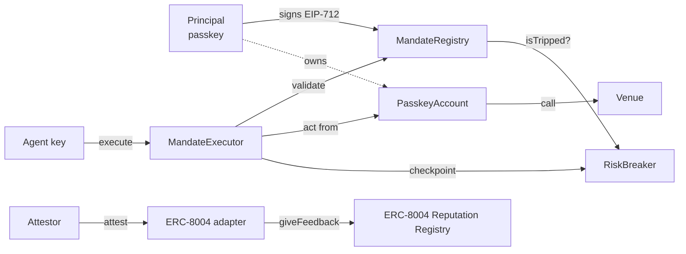

# Concepts

Three ideas carry the whole protocol: a **mandate** says what an agent may do, a **breaker** says when it must stop, and **reputation** records how it behaved. Everything else is plumbing.

## Mandate

A mandate is an EIP-712 struct the principal signs with a passkey. It names the agent (ERC-8004 id and executing key), the exact contracts and function selectors the agent may call, the spend asset, a lifetime cap, a per-block cap, a drawdown threshold, a validity window, a per-principal nonce, and a hash committing to an off-chain policy blob.

The signature is bound to the chain id and the registry address, so it cannot be replayed elsewhere. The registry stores the mandate under its struct hash. That hash is the identifier everyone uses afterwards.

Execution goes through one door. The agent calls `MandateExecutor.execute` with the mandate hash, a target, calldata and an upper bound on asset outflow. The executor asks the registry to validate the call, performs it *from the principal's account*, measures how much of the asset actually left, and refuses if that exceeds the declared bound. Spend is recorded against both caps. Every failure mode is a named custom error, and the SDK raises the same name before anything is sent.

Revocation is a single call by the principal. It takes effect in the block it lands, because the registry checks the flag on every validate.

## Breaker

Spend caps limit how much an agent can move. They say nothing about whether the agent is losing money. The breaker does.

The `RiskBreaker` tracks each mandate's peak equity, by default the principal's balance of the spend asset. Drawdown is the distance from that peak. When drawdown exceeds the mandate's `maxDrawdownBps`, the breaker moves from **Armed** to **Tripped** and emits a `Tripped` event. While tripped, nothing executes.

Re-arming is deliberately harder than tripping. After a cooldown measured in blocks the breaker enters **Cooldown**, and only returns to **Armed** once drawdown falls under a re-arm threshold that is a fraction of the trip threshold. The gap between the two lines is hysteresis: a mandate cannot flap between frozen and live on every tick.

Checkpoints are permissionless. The executor checkpoints after every execution, but a keeper or the reputation workflow can also record a trip caused by a market move with no agent action. The principal alone can re-baseline the peak, and can plug a valuation adapter when the raw balance is not the right measure of equity.

## Reputation

An agent's reputation is not a score it reports about itself. It is a set of attestations written by one authorised **attestor**, in the reference deployment the Chainlink CRE workflow, computed from on-chain evidence: executions against mandate bounds, breaker trips, and realised PnL.

Each attestation carries a compliance score from 0 to 100, trip and execution counts, PnL in basis points, the time window, and an `evidenceHash` over the inputs, so anyone can recompute and verify it. The adapter stores the attestation, emits `ReputationAttested`, and mirrors the score into the ERC-8004 Reputation Registry tagged `mandate-compliance`. Agents, principals and even the adapter's owner are rejected if they try to attest.

Because the evidence is on-chain and the writer is a single accountable role, the reputation is portable: any protocol that trusts the attestor can read the ERC-8004 registry and get the same answer, with no dependency on Mandate's own contracts.

## Putting it together

A principal grants once. The agent then acts as often as it likes, inside the box the mandate drew, until it hits a cap, the breaker trips, the window closes, or the principal revokes. The record of how it behaved outlives the mandate, attached to the agent's ERC-8004 identity.
